<div align="center">


<h1>Retail Landing Zone Platform</h1>

<p><strong>The Strategic Cloud Foundation for Omnichannel Retail, POS Systems, and Global Supply Chain Excellence</strong></p>

[]()
[]()
[]()

<br/>

> **"Retail is detail, and the cloud is the ultimate detail engine."** 
> Retail Landing Zone (Retail-LZ) is an enterprise-grade platform designed to provide a secure, scalable, and industry-aligned foundation for modern retail workloads. It orchestrates the complex interplay between e-commerce storefronts, physical POS systems, global inventory hubs, and customer data platforms. By providing a standardized architecture that aligns with PCI-DSS requirements and omnichannel delivery patterns, it enables retailers to innovate faster, optimize supply chains, and deliver seamless customer experiences across every touchpoint.

</div>

---

## 🏛️ Executive Summary

Modern retail is no longer just about selling products; it's about managing a high-frequency global data ecosystem. Organizations fail to scale their digital transformations because of fragmented networking, inconsistent security postures across stores, and siloed data platforms.

This platform provides the **Retail Cloud Control Plane**. It implements a complete **Omnichannel Framework**—from hub-and-spoke networking that connects thousands of stores to the cloud, to automated inventory synchronization and regional cost allocation models. By operationalizing the retail landing zone, it ensures that your digital infrastructure is as resilient as your physical stores and as agile as your customer's demands.

---

## 🏛️ Core Retail Pillars

1. **Omnichannel Foundation**: Unified networking and identity model that spans e-commerce, mobile apps, and physical store locations (POS).
2. **Global Inventory Orchestration**: Real-time stock tracking and automated replenishment logic across multiple warehouses and store locations.
3. **PCI-DSS Aligned Security**: Hardened security patterns designed for payment processing environments, including network isolation and data encryption.
4. **Supply Chain Visibility**: Integrated telemetry for order processing, logistics tracking, and supply chain health monitoring.
5. **Customer Data Platform (CDP)**: Centralized identity and loyalty management to provide a 360-degree view of the retail customer journey.
6. **Retail FinOps & Economics**: Regional cost allocation models and store-level budget tracking to ensure cloud efficiency matches business margins.

---

## 📐 Architecture Storytelling: 50+ Advanced Diagrams

### 1. The Omnichannel Retail Lifecycle
*The flow from customer engagement to order fulfillment.*
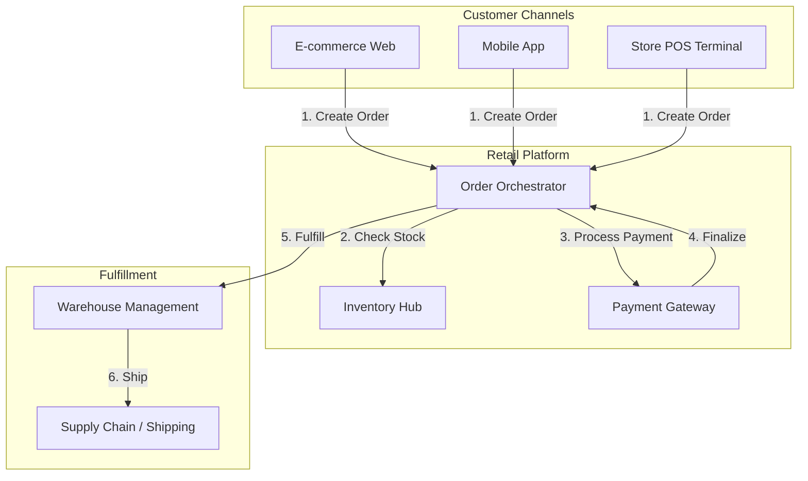

### 2. Hub-and-Spoke Retail Networking
*Connecting stores and regional hubs to the central cloud foundation.*
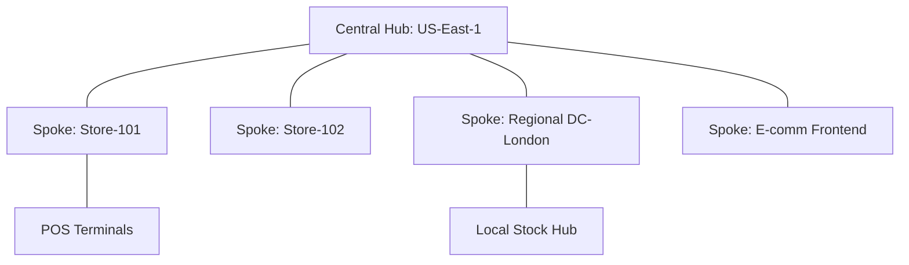

### 3. Inventory Synchronization Flow
*Ensuring real-time stock accuracy across all channels.*
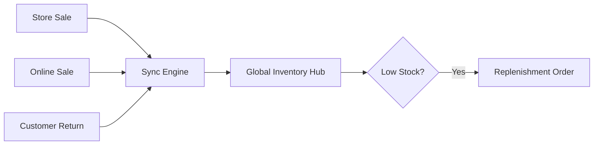

### 4. Retail RBAC & Identity Model
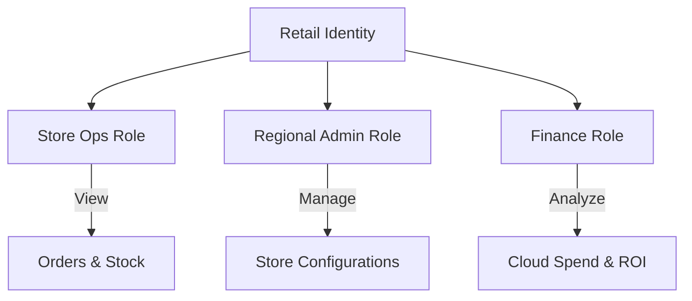

### 5. Deployment Topology: Multi-Region High Availability
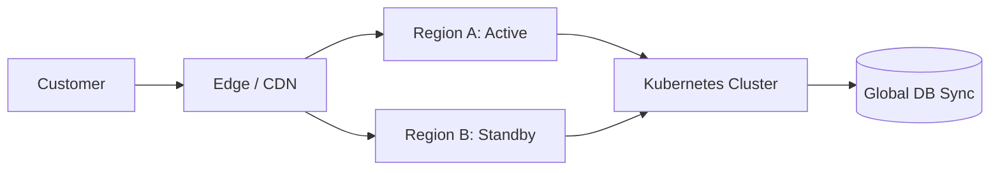

### 6. Order State Machine


### 7. Foundation: Multi-Environment Setup
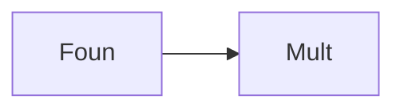

### 8. Networking: Private Connectivity
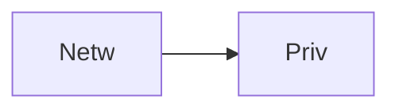

### 9. Component: Order Service
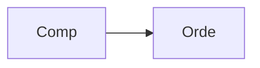

### 10. Component: Inventory Service
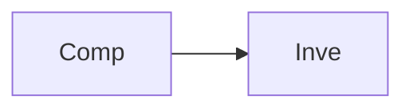

### 11. Component: Customer Service
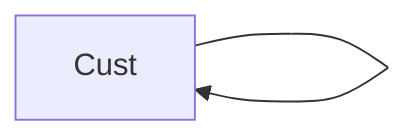

### 12. Component: POS Connector
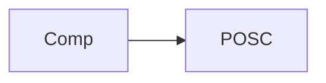

### 13. Logic: Order Validation
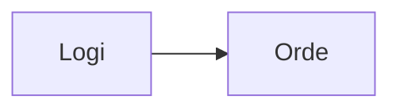

### 14. Logic: Replenishment Trigger
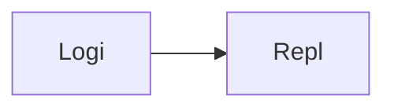

### 15. Logic: Conversion Calculation
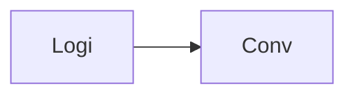

### 16. Logic: Regional Cost Weighting
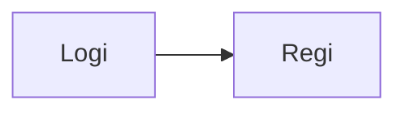

### 17. Architecture: Central Retail Hub
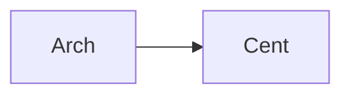

### 18. Architecture: Store-Edge Connectivity
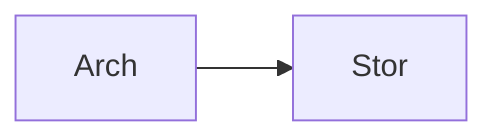

### 19. Architecture: Real-time Analytics Lake
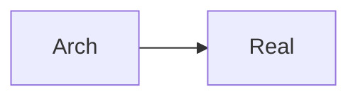

### 20. Pattern: Event-driven Inventory


### 21. Pattern: Store-as-a-Spoke
```mermaid
graph LR
    P[Patt] --> S[Stor]
```

### 22. Pattern: Compliance-as-Code (PCI)
```mermaid
graph LR
    P[Patt] --> C[Comp]
```

### 23. Security: Tokenized Payments
```mermaid
graph LR
    S[Secu] --> T[Toke]
```

### 24. Security: Store VPN Tunneling
```mermaid
graph LR
    S[Secu] --> S[Stor]
```

### 25. Security: Encrypted PII Data
```mermaid
graph LR
    S[Secu] --> E[Encr]
```

### 26. Feature: Real-time Stock Ticker
```mermaid
graph LR
    F[Feat] --> R[Real]
```

### 27. Feature: Store Performance Heatmap
```mermaid
graph LR
    F[Feat] --> S[Stor]
```

### 28. Feature: Order Tracking Map
```mermaid
graph LR
    F[Feat] --> O[Orde]
```

### 29. Compliance: PCI Audit Logs
```mermaid
graph LR
    C[Comp] --> P[PCIA]
```

### 30. Compliance: GDPR Customer Rights
```mermaid
graph LR
    C[Comp] --> G[GDPR]
```

### 31. Infrastructure: Redis Stock Cache
```mermaid
graph LR
    I[Infr] --> R[Redi]
```

### 32. Infrastructure: Postgres Retail DB
```mermaid
graph LR
    I[Infr] --> P[Post]
```

### 33. Deployment: Kubernetes Retail Pods
```mermaid
graph LR
    D[Depl] --> K[Kube]
```

### 34. Deployment: Multi-Region Store Sync
```mermaid
graph LR
    D[Depl] --> M[Mult]
```

### 35. Monitoring: Order Success Dashboard
```mermaid
graph LR
    M[Moni] --> O[Orde]
```

### 36. Monitoring: Store Latency Heatmap
```mermaid
graph LR
    M[Moni] --> S[Stor]
```

### 37. UI: Store Ops Dashboard
```mermaid
graph LR
    U[UI] --> S[Stor]
```

### 38. UI: Inventory Hub View
```mermaid
graph LR
    U[UI] --> I[Inve]
```

### 39. UI: Customer Journey Workspace
```mermaid
graph LR
    U[UI] --> C[Cust]
```

### 40. UI: Retail KPI Analytics
```mermaid
graph LR
    U[UI] --> R[Reta]
```

### 41. CI/CD: Retail service build pipeline
```mermaid
graph LR
    C[CICD] --> R[Reta]
```

### 42. CI/CD: POS integration test pipeline
```mermaid
graph LR
    C[CICD] --> P[POSI]
```

### 43. Strategy: Customer-Centric Retail
```mermaid
graph LR
    S[Stra] --> C[Cust]
```

### 44. Strategy: Inventory Frugality
```mermaid
graph LR
    S[Stra] --> I[Inve]
```

### 45. Feature: Auto-replenishment Orders
```mermaid
graph LR
    F[Feat] --> A[Auto]
```

### 46. Feature: Mobile App Store Locator
```mermaid
graph LR
    F[Feat] --> M[Mobi]
```

### 47. Feature: Loyalty Point Calculator
```mermaid
graph LR
    F[Feat] --> L[Loya]
```

### 48. Logic: Sentiment Analysis on Feedback
```mermaid
graph LR
    L[Logi] --> S[Sent]
```

### 49. Data Model: Retail Order Entity
```mermaid
graph LR
    D[Data] --> R[Reta]
```

### 50. Enterprise Retail Resilience
```mermaid
graph LR
    E[Entr] --> R[Reta]
```

---

## 🛠️ Technical Stack & Implementation

### Retail Engine & APIs
- **Framework**: Python 3.11+ / FastAPI.
- **Order Engine**: Lifecycle management for omnichannel orders.
- **Inventory Engine**: Real-time stock tracking and replenishment logic.
- **POS Integration**: Simulated store terminal synchronization.
- **Governance Hub**: Regional cost allocation and retail-specific RBAC.
- **Cache**: Redis for high-speed stock availability and session management.
- **Persistence**: PostgreSQL for order history, customer profiles, and metadata.
- **Identity**: OIDC / JWT with role-based store operations access.

### Frontend (Retail Dashboard)
- **Framework**: React 18 / Vite.
- **Theme**: Dark Blue / Emerald (Modern Retail aesthetic).
- **Visualization**: Recharts for revenue trends and conversion metrics.

### Infrastructure
- **Runtime**: AWS EKS (Kubernetes).
- **Deployment**: Helm charts for retail services and dashboard distribution.
- **IaC**: Terraform (Modular with Retail focus).

---

## 🚀 Deployment Guide

### Local Development
```bash
# Clone the repository
git clone https://github.com/devopstrio/retail-lz.git
cd retail-lz

# Setup environment
cp .env.example .env

# Launch the Retail stack (API, Services, DB, Redis, UI)
make up

# Seed initial inventory
make seed-inventory

# Simulate POS order sync
make sync-orders
```
Access the Retail Dashboard at `http://localhost:3000`.

---

## 📜 License
Distributed under the MIT License. See `LICENSE` for more information.
