<div align="center">


<h1>Retail Landing Zone Platform</h1>

<p><strong>The Strategic Cloud Foundation for Omnichannel Retail, POS Systems, and Global Supply Chain Excellence.</strong></p>

[]()
[]()
[]()

<br/>

> **"Retail is detail, and the cloud is the ultimate detail engine."** 
> **Retail Landing Zone (Retail-LZ)** is an enterprise-grade platform designed to provide a secure, scalable, and industry-aligned foundation for modern retail workloads. It orchestrates the complex interplay between e-commerce storefronts, physical POS systems, global inventory hubs, and customer data platforms.

</div>

---

## 🏛️ Executive Summary

Modern retail is no longer just about selling products; it's about managing a high-frequency global data ecosystem. Organizations often fail to scale their digital transformations because of fragmented networking and inconsistent security postures across thousands of physical stores that create significant operational friction.

This platform provides the **Retail Cloud Control Plane**. It implements a complete **Omnichannel Framework**, enabling Retail IT and Digital Transformation teams to manage global commerce as a first-class citizen. By automating the deployment of store-edge infrastructure and the synchronization of global inventory, we ensure that every retail asset is resilient, secured by design, and optimized for seamless customer experiences across every touchpoint.

---

## 📐 Architecture Storytelling: Principal Reference Models

### 1. Principal Architecture: Global Retail Landing Zone & Commerce Orchestration Plane
This diagram illustrates the end-to-end flow from omnichannel customer engagement to edge-side POS processing, cloud-native order fulfillment, and institutional auditing.

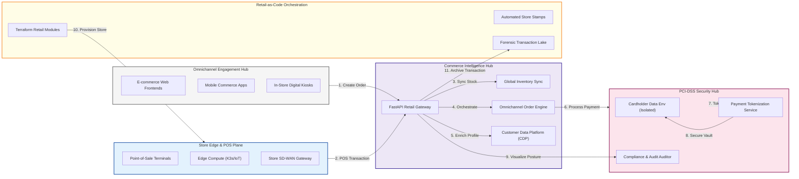

### 2. The Retail Lifecycle Management Flow
The continuous path of a retail transaction from initial engagement and ordering to secure fulfillment and delivery.

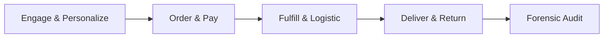

### 3. Tiered Retail Zone Model
Standardizing retail infrastructure across Corporate HQ, Regional Distribution Centers, and physical Store Edge locations.

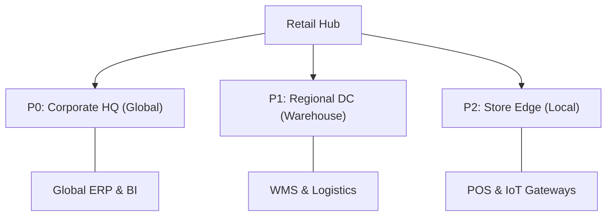

### 4. PCI-DSS 4.0 Compliant Perimeter
Isolating the Cardholder Data Environment (CDE) to minimize audit scope and ensure institutional payment security.

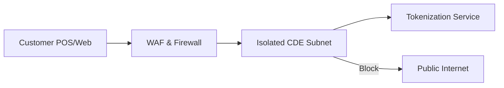

### 5. Inventory Intelligence & Stock Sync Flow
Ensuring real-time stock accuracy across web, mobile, and thousands of physical store locations.

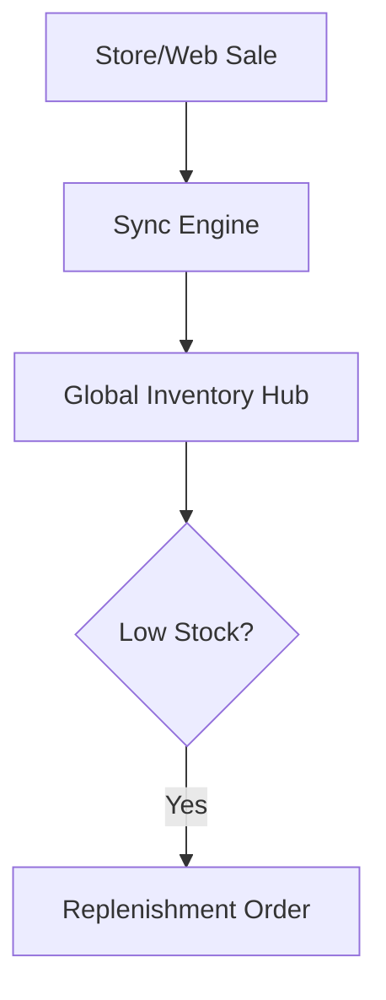

### 6. Edge Compute Node Architecture (K3s/IoT)
Deploying low-latency processing at the store edge to handle POS transactions and local IoT telemetry.

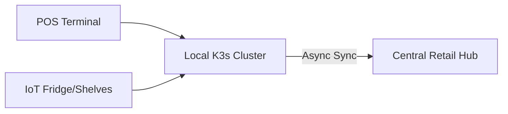

### 7. Omnichannel Commerce Integration Hub
Converging disparate sales channels into a unified commerce engine for consistent pricing and promotion management.

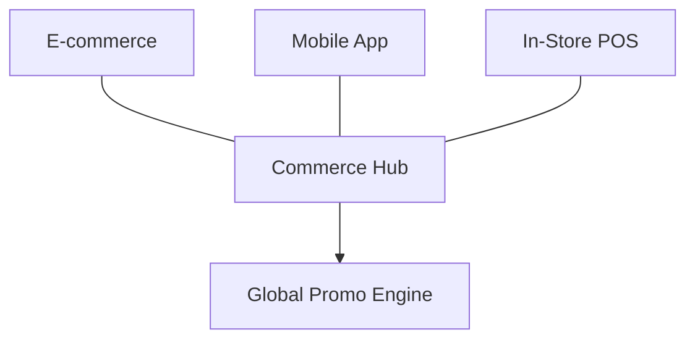

### 8. Identity & RBAC for Retail Governance
Managing fine-grained access to retail operations based on organizational roles and store hierarchies.

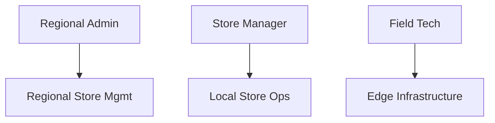

### 9. Retail Compliance Scorecard & Security Posture
Monitoring organizational adherence to PCI-DSS, GDPR, and CCPA standards across all retail touchpoints.

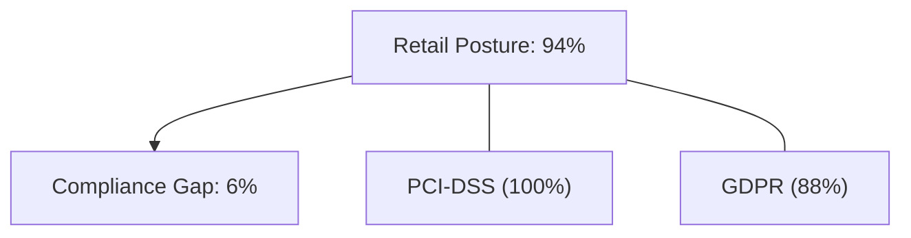

### 10. IaC Deployment: Retail-as-Code Framework
Using Terraform to deploy standardized "store stamps" that include all necessary networking, compute, and security resources.

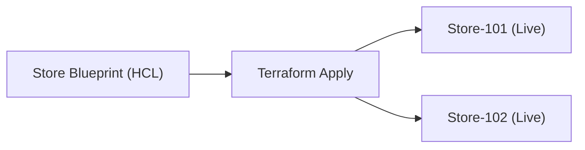

### 11. Metadata Lake for Forensic Retail Audit
Storing long-term records of every transaction, inventory change, and administrative action for institutional auditing.

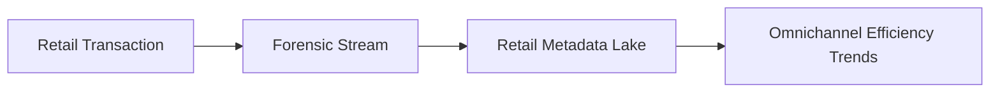

---

## 🏛️ Core Retail Pillars

1.  **Omnichannel Foundation**: Unified networking and identity model spanning e-commerce and physical POS terminals.
2.  **Global Inventory Orchestration**: Real-time stock tracking and automated replenishment across warehouses and stores.
3.  **PCI-DSS Aligned Security**: Hardened security patterns designed for isolated payment processing environments.
4.  **Supply Chain Visibility**: Integrated telemetry for order processing, logistics tracking, and supply chain health.
5.  **Customer Data Platform (CDP)**: Centralized identity and loyalty management for a 360-degree customer view.
6.  **Retail FinOps & Economics**: Regional cost allocation and store-level budget tracking for operational efficiency.

---

## 🛠️ Technical Stack & Implementation

### Retail Engine & APIs
*   **Framework**: Python 3.11+ / FastAPI.
*   **Order Engine**: Lifecycle management for omnichannel orders and payment orchestration.
*   **Inventory Engine**: Real-time stock tracking with asynchronous replenishment logic.
*   **POS Integration**: Standardized connectors for store-edge terminal synchronization.
*   **State Management**: PostgreSQL (Metadata Lake) and Redis (Stock Cache).

### Retail Dashboard (UI)
*   **Framework**: React 18 / Vite.
*   **Theme**: Dark Blue / Emerald (Modern Retail aesthetic).
*   **Visualization**: Recharts for revenue trends, conversion rates, and store performance heatmaps.

### Infrastructure & DevOps
*   **Runtime**: AWS EKS or Azure Kubernetes Service (AKS).
*   **IaC**: Modular Terraform for deploying store stamps and central hub distributions.

---

## 🏗️ IaC Mapping (Module Structure)

| Module | Purpose | Real Services |
| :--- | :--- | :--- |
| **`infrastructure/hub`** | Central management plane | EKS, PostgreSQL, Redis |
| **`infrastructure/edge`** | Store-side compute and network | K3s, SD-WAN, IoT Greengrass |
| **`infrastructure/pci`** | Payment security and isolation | WAF, Private Link, KMS |
| **`infrastructure/analytics`** | Retail BI and audit sinks | S3, Athena, Quicksight |

---

## 🚀 Deployment Guide

### Local Principal Environment
```bash
# Clone the retail platform
git clone https://github.com/devopstrio/retail-lz.git
cd retail-lz

# Configure environment
cp .env.example .env

# Launch the Retail stack
make up

# Seed initial inventory data
make seed-inventory

# Simulate POS transaction sync
make sync-pos
```

Access the Retail Dashboard at `http://localhost:3000`.

---

## 📜 License
Distributed under the MIT License. See `LICENSE` for more information.

---
<div align="center">
  <p>© 2026 Devopstrio. All rights reserved.</p>
</div>
